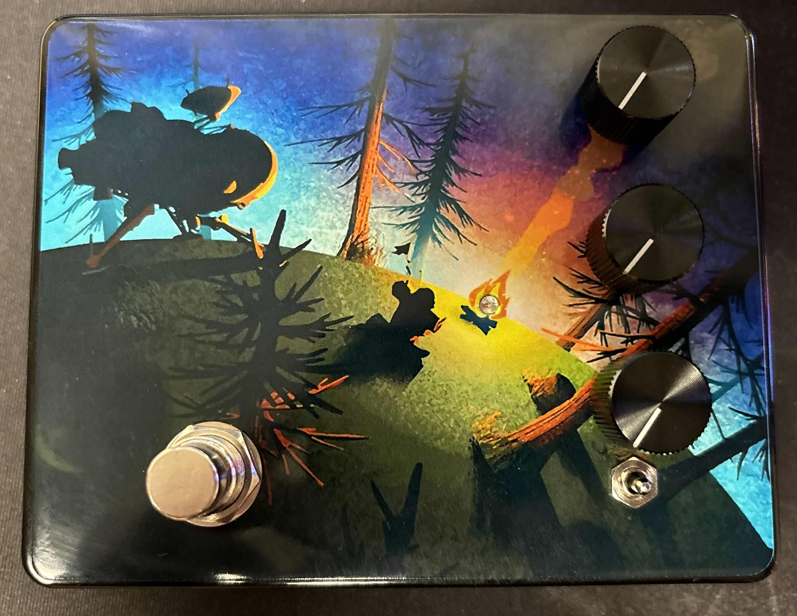
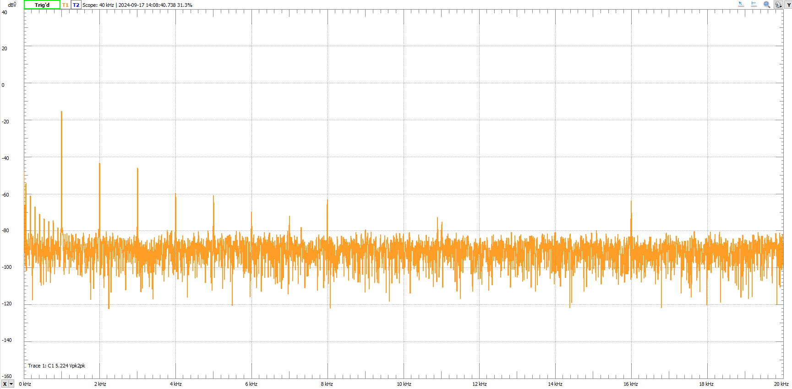
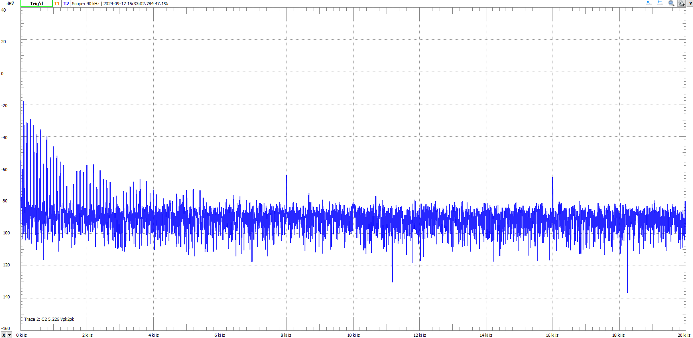

# Low Noise Versatile Digital Distortion

## Goal / Problem Statement

There are a few main goals I had in mind with this project. The first was improving the severe noise compared to my last pedal. The second was designing and implementing my own digital filters. This means no external signal processing libraries.
The third was to make a pedal that was a master of one rather than a jack of all trades.

This was so I could improve my own understanding of DSP and filter design, but also to practice anti-aliasing techniques to improve noise performance. I also thought this would be a good opportunity to make this a dedicated distortion pedal since the EQ
/ tone stack / filtering is basically the only thing that sets two distortion pedals apart. There were other small improvements I also wanted to make such as a way to bypass quantization, anti-aliasing filters on the input and output, and codec input
voltage protection.

## Distortion Effect

Distortion is a very simple effect to create in analog. All you need are 2 diodes, or 1 zener.
You just put two diodes in reverse in the feedback loop of an amplifier to create soft clipping, or after the op amp shorted to ground for hard clipping. 

By clipping our input we are essentially turning our amplified sine wave into a square wave. This means we are creating harmonics at odd multiples of the base frequency. This gives us a lot to work with since by filtering some harmonics and leaving others, 
we have a lot of possible ways to play with our sound and make it sound even more interesting than it already does. This is why there are so many distortion pedals on the market. It is just as simple to create a digital distortion. We just need to take our 
input samples, amplify them, and then put them through a nonlinear curve. Tanh is a popular soft clipping function. To create hard clipping it’s as simple as amplitude limiting, or an if statement in other words. 

## The Problem With Digital Distortion And Solution

In analog, these harmonics are not an issue. They will go to an amplifier and that's the end of the story. But in digital, these harmonics will alias the moment the samples are processed through the nonlinearity. This creates so much noise, that it 
sounds like white noise with all the harmonic content spread across the spectrum. To fix this, I initially applied oversampling. By sampling at 96k instead of 48k, my bandwidth was doubled, and that directly reduces the amount of harmonics that will 
alias. And, some of the ones that do, will be outside the audible band anyway. But this just didn’t cut it. So I tried upsampling. This involves adding zeros between samples, low pass filtering the signal, applying the distortion, anti-aliasing low pass 
filtering, and then downsampling back to 96k. The most I could get out of thestm32 was 5 times upsampling. This created a temporary sampling rate of 480k. Now this was able to give me the amount of bandwidth needed, to immensely improve the performance 
of the pedal. The before and after was night and day. The drawback, though, was the sheer amount of processing power needed to improve this. I was hoping to get 8 times upsampling, but I was using about 95% of the cpu for 5 times. However, I was quite 
satisfied with the results regardless, but I wanted to optimize the code to get better performance. 

That's when I stumbled onto a paper from 2016 on a technique called anti derivative anti-aliasing. This technique basically involved applying the integral of the nonlinear function rather than the actual nonlinearity. Now, I’m not going to act like I 
understand how it works, the math goes a bit over my head, But I was able to apply it and it worked like magic. It slashed my cpu load, while even performing a bit better. But there was one thing that was wrong. There is an error with my code, but the 
paper didn’t actually give any code so I’m not sure where I went wrong. This causes the nonlinearity to be applied asymmetrically to both cycles of the input. But the crazy part is this is actually a good thing! Since it is asymmetrical, we actually get 
harmonics at even and odd multiples of the base frequency. This is desirable since this mimics the performance of vintage vacuum tubes, which some guitar amps are based on. Guitarists tend to like this sound since it’s similar to their favorite bands 
from when vintage was modern.

## My pedal In Detail

I wanted to take a moment before showing the schematic and waveforms to talk about the features of this pedal. This pedal has a 3 way toggle switch to swap between 3 pedals I took inspiration from. The left position is the Ibanez TS-9 Tube Screamer.
This is a soft clipping overdrive pedal. The second is the Electro-Harmonix Big Muff Pi. This is an example of Hard Clipping Distortion. The last was a challenge I set for myself. It is the Boss HM-2. This is a crazy pedal that chains a gain soft
clipping stage, into another gain hard clipping stage. Finally it sends this signal into a wild filtering stage. The challenge with this pedal was creating a frequency response that mimics the original. My pedal features 3 knobs: gain, tone, and volume.
Since this is digital, it's easy to change frequency response as well as the distortion. It has relay bypass to avoid quantization when not in use. This also has a bonus of allowing the pedal to act as a wire even when not plugged into power. I added
voltage protection to the audio inputs by using the protection of the MCP6004 op amp. It features second order sallen-key input and output filters. I am sampling at 96k. This pedal is based around the Daisy Seed by Electrosmith. It is an audio DSP board
featuring an STM32H750 as well as a 24 bit stereo codec (This pedal is mono). There is also an indicator LED when the effect is on. This leads me to the art on the pedal. The LED lights the campfire in the art. The art is not mine, it is promo art for
the video game Outer Wilds. I initially wanted to label the knobs, but I still needed art. Once I saw this art and had the LED idea, I abandoned labels for looks. I justify this by arguing I am the only person who will use this so it's ok since I know
how it works. 

The enclosure was ordered, drilled, and UV printed at Tayda Electronics. 
The PCB is a 4 layer board with a signal / gnd / gnd / signal stackup. I designed it in KiCAD and had manufactured by JLCPCB. I made sure to follow best practices such as proper grounding, filter capcitors on power pins, and trace spacing.
The rest of the components came from Mouser. 

It's powered from a center negative 9v dc barrel plug. The pedal uses about 150-200 mA. Compared to analog distorion pedals which use about 10-20mA, mine is much higher. To be fair, the indicator LED in the analog pedals is the main culprit.
The op amps basically use nothing.

The footswitch used currently is momentary SPST. But there are actually two connectors on the board. This is actually support for latching switches. If you want a clicky latching switch, just plug it to the other connector.
Currently I have to reprogram it to detect a latching switch, in the next iteration I will have it connect to another GPIO pin so that only one program is needed to support both types. I used a molex microlatch for momentary and JST for latching

I debated putting the relay into a DIP socket, but unfortunatle the legs are too short for me to be confident it won't fall out with someone stomping on the box.

I used a negative terminal battery spring so I could ground the enclosure for shielding. They are pretty cheap so I think it's a pretty good solution. 

## My Pedal's Performance
Here is the Performance of the Overdrive effect of my pedal. This pedal has a highpass filter into an adjustable lowpass. Compared to the real TS-9 I made the tone knob go to 500Hz rather than ~2k since I like the underwater sound a lowpass gives. Input 
is a 400mV p-p sine wave at 1KHz.

Min mid and max refer to the knob's postion for these tests.

Min gain max tone

Max gain max tone

Max gain min tone

Min gain max tone

Max gain max tone

Max gain min tone

Max tone

Mid tone

Min tone

Next is the Big Muff. This pedal has an output lowpass and highpass that are mixed together using a pot. I did the same, but boosted the high end since it's quieter.

Min gain mid tone

Max gain mid tone

Max gain max tone

Max gain min tone

Max gain mid tone

Max gain max tone

Max gain min tone

Mid tone

Max tone

Min tone

Finally we have the HM-2. Unlike the other two pedals which are very popular, this one is quite niche. It saw a lot of success in the Swedish death metal scene in the 90s. This is due to its unique frequency response that was probably not intended to be 
used like that. The original pedal is 4 knobs, that give you a lot of control over the sound. The pedal was mainly used with everything cranked up to the max to get that famous sound. My take on this was to give it a similar frequency response when the 
tone knob is cranked all the way. But as you roll it back you get a pure unfiltered distortion. I thought this was a good idea since the other effects I implemented never give you the square wave distortion originally was. This was also a compromise 
since I only wanted to use three knobs on my pedal to minimize control clutter.

I changed the input frequency to 100Hz to better display its EQ since it mainly lives in the 0 to 2kHz area.

Min gain min tone

Max gain min tone

Max gain mid tone

Max gain max tone

Min gain min tone

Max gain min tone

Max gain mid tone

Max gain max tone

Min tone

Midin tone

Max tone

## Schematic

## Conclusion / Final Thoughts

I made a pedal that I'm very proud of. I think it looks amazing, and functions amazingly. Yeah, eye of the beholder, but I have a lot of fun using this pedal. Although I plan on having some people review it for me so I can get feedback. I do plan on 
selling this pedal eventually. I just need original art, and to actually label the jacks and knobs. There were some issues however. The first is clearance. The regulator and the Seed are a bit too tall. I remedied this by bending the regulator, but I 
can't do that for the Seed. I was planning on snipping the debugger header after final programming. I also want to put more room between the toggle  and the pots. I was thinking about moving the  5mm down and the knobs 5mm up. I also wanted 
to move the audio and power jacks over a bit because the PCB gets a little too close to the enclosure for comfort. Tolerance could stop the parts from mating correctly. I also forgot to make front holes a bit bigger to account for the thickness of the 
gloss. So thats another thing that needs to change. 

As for what comes next, I was showing this project to a faculty member who helped me during my senior project and he asked why I just didn't put the MCU and codec on my boards and do all the hardware myself. And at first I thought no way I could do 
that. It would be too difficult and take too much time. But then I remembered I'm ambitious and I make things happen when I want them too. I'm the goat fr. So I've been reading datasheets for the last week and begun work on just that. As for the functionality it will be the exact same as this but it will be completely designed by me. This will cut costs significantly as I move to SMT. Although this will be a big loss for repairability. If I ever do get around to selling these I may sell both versions for people that value that like me. I don't even have the tools or know how to do SMT soldering so I will have to have the boards manufactured for me. 
